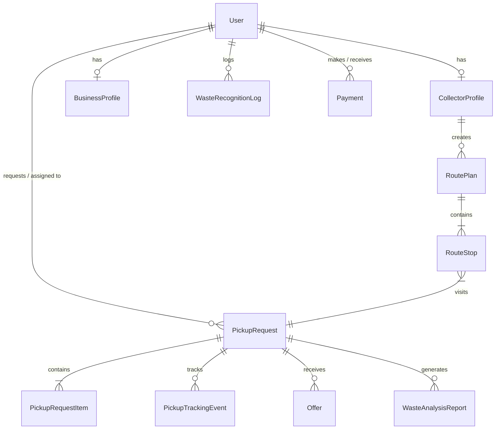
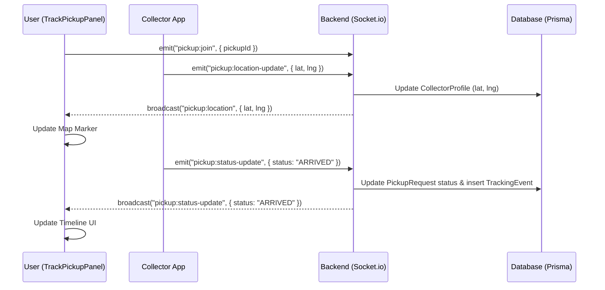
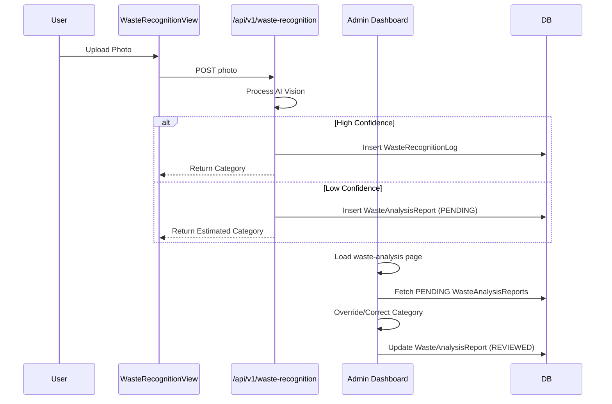

# WasteWise Architecture Documentation

## 1. Project Structure

The WasteWise codebase is organized into two primary monorepo-style folders: `web` (Frontend) and `server` (Backend).

### `server/` (Backend - Node.js / Express / Socket.io)
- **`prisma/`**: Contains the database schema definition (`schema.prisma`) and migrations.
- **`src/`**: The main backend source code.
  - **`routes/`**: Express route controllers organized by feature (e.g., `admin.ts`, `auth.ts`, `pickups.ts`, `wasteRecognition.ts`).
  - **`middleware/`**: Express middlewares (e.g., authentication, error handling).
  - **`lib/`**: Shared backend utilities (e.g., `prisma.ts`, `logger.ts`, `notifications.ts`, `routeService.ts`).
  - **`realtime/`**: Socket.io event handlers for realtime features (`socket.ts`, `pickupEvents.ts`, `chat.ts`).
  - **`app.ts` / `index.ts`**: Entry points configuring the Express application and HTTP/WebSocket server.

### `web/` (Frontend - Next.js App Router)
- **`app/`**: Next.js App Router structure defining all pages, layouts, and route groups.
  - **`(user)/`**: Routes restricted to standard users/households.
  - **`(collector)/`**: Routes restricted to collector accounts.
  - **`(admin)/`**: Routes restricted to system administrators.
  - **`(business)/`**: Routes restricted to business accounts.
- **`components/`**: Reusable React UI components (`Card.tsx`, `Map.tsx`, `Button.tsx`).
- **`lib/`**: Frontend utilities and API clients (`api/` folder for client SDKs, `socket.ts` for WebSocket connections, `auth/` for authentication context).
- **`public/`**: Static assets.

---

## 2. Pages & Routing

The frontend utilizes Next.js App Router with Route Groups to isolate roles.

### User Routes (`/web/app/(user)`)
- **Dashboard Home**: `app/(user)/dashboard/page.tsx` -> `/dashboard`
- **Pickup Tracking (Active Pickup)**: `app/(user)/dashboard/pickups/page.tsx` -> `/dashboard/pickups`
- **Find a Collector**: `app/(user)/dashboard/collectors/page.tsx` -> `/dashboard/collectors`
- **Smart Pickup (Waste Recognition)**: `app/(user)/waste-recognition/page.tsx` -> `/waste-recognition`

### Collector Routes (`/web/app/(collector)`)
- **Dashboard Home**: `app/(collector)/collector/page.tsx` -> `/collector`
- **Smart Route Planner**: `app/(collector)/collector/route/page.tsx` -> `/collector/route`
- **Available Jobs**: `app/(collector)/collector/jobs/page.tsx` -> `/collector/jobs`

### Admin Routes (`/web/app/(admin)`)
- **Admin Dashboard**: `app/(admin)/admin/page.tsx` -> `/admin`
- **Waste Analysis Reports**: `app/(admin)/admin/waste-analysis/page.tsx` -> `/admin/waste-analysis`

### Routing Mechanism
- Cross-page routing is done using Next.js `<Link href="...">` or `useRouter()`.
- **Protected Routes**: Gated via `useRequireRole` inside the components or layouts (e.g., `useRequireRole(["USER"])` in `WasteRecognitionView.tsx`), restricting access based on the logged-in user's role.

---

## 3. Component Architecture

### `TrackPickupPanel.tsx` (`web/components/TrackPickupPanel.tsx`)
- **Location**: Renders inside `app/(user)/dashboard/pickups/page.tsx`.
- **Relationships**: Parent to `Map.tsx`, `StatusTimeline.tsx`, `ChatWidget.tsx`.
- **State/Hooks**: Manages `status`, `collectorLocation`, `pickupLocation` using `React.useState`. Subscribes to realtime updates via `React.useEffect` and `getTrackingSocket()`.
- **Services**: Uses `getPickupTracking`, `getPickupDetail` from `@/lib/api/pickups`.

### `RoutePlannerView.tsx` (`web/components/RoutePlannerView.tsx`)
- **Location**: Renders inside `app/(collector)/collector/route/page.tsx`.
- **Relationships**: Parent to `Map.tsx`, `CollectorEmptyState.tsx`, `ActiveJobTracker.tsx`.
- **State/Hooks**: Manages `route`, `excludedPickupIds` to let collectors customize their route. 
- **Services**: Uses `getActiveRoute`, `getSuggestedRoute`, `startRoute` from `@/lib/api/routes`.

### `WasteRecognitionView.tsx` (`web/components/WasteRecognitionView.tsx`)
- **Location**: Renders inside `app/(user)/waste-recognition/page.tsx`.
- **State/Hooks**: Local state for `previewUrl`, `result`, `isScanning`. Uses file input references for uploads.
- **Services**: Connects to `scanWastePhoto`, `getMyWasteScans`, `correctWasteScan` from `@/lib/api/wasteRecognition`.

### `CollectorsDirectoryView.tsx` (`web/app/(user)/dashboard/collectors/CollectorsDirectoryView.tsx`)
- **Location**: Renders inside `app/(user)/dashboard/collectors/page.tsx`.
- **State/Hooks**: `location`, `vehicleType`, `minRating`, `collectors` array.
- **Services**: Connects to `getVerifiedCollectors` from `@/lib/api/collectors`.

---

## 4. Frontend → Backend Flow

### Example 1: Active Pickup Realtime Tracking
**Page**: User Pickups (`/dashboard/pickups`)
-> **Component**: `TrackPickupPanel`
-> **Hook**: `getTrackingSocket().on("pickup:status-update")`
-> **API (WebSocket)**: Emit/Listen over Socket.io
-> **Socket Controller**: `server/src/realtime/pickupEvents.ts` (`handleLocationUpdate`, `handleStatusUpdate`)
-> **Service**: `authorizePickupAccess()`
-> **Database**: Update `CollectorProfile`, `PickupRequest`, and insert `PickupTrackingEvent` using Prisma.

### Example 2: Requesting Waste Analysis
**Page**: Waste Recognition (`/waste-recognition`)
-> **Component**: `WasteRecognitionView`
-> **Hook**: `scanWastePhoto(file)`
-> **API**: `POST /api/v1/waste-recognition/scan`
-> **Route**: `server/src/routes/wasteRecognition.ts`
-> **Service**: Invokes Google Cloud Vision API (implied/abstracted) for labels.
-> **Database**: Inserts `WasteRecognitionLog` and optionally `WasteAnalysisReport` using Prisma.
-> **Response**: Returns categorized result and confidence.

---

## 5. Database Architecture

- **Technology**: PostgreSQL accessed via Prisma ORM.
- **Schema Location**: `server/prisma/schema.prisma`

### Key Models
- **`User`**: Core identity (Role: USER, COLLECTOR, ADMIN, RECYCLING_COMPANY).
- **`CollectorProfile`**: Extended collector details (vehicle, location, rating).
- **`PickupRequest`**: Core transaction connecting a user and a collector. Tracks status (`PickupStatus`), location, and items.
- **`PickupTrackingEvent`**: Audit log of status transitions for a pickup.
- **`RoutePlan` & `RouteStop`**: Manages a collector's optimized sequential list of pickups.
- **`WasteRecognitionLog`**: History of AI waste photo scans.
- **`WasteAnalysisReport`**: Items flagged for admin manual review due to low AI confidence.

### Entity-Relationship Diagram

---

## 6. Requested Feature Architecture

### 1. User Real-Time Pickup Tracking
- **Page**: `app/(user)/dashboard/pickups/page.tsx` -> `TrackPickupPanel.tsx`
- **Realtime Mechanism**: Utilizes Socket.io. The component connects via `getTrackingSocket()`.
- **Collector Location**: The collector's device emits `pickup:location-update`. The server broadcasts `pickup:location` to the room, which `TrackPickupPanel` uses to update the `<Map />` component.
- **Backend Flow**: `pickupEvents.ts` handles the WebSocket events, verifies permissions via `authorizePickupAccess()`, updates the DB (`CollectorProfile.lastKnownLatitude/Longitude`), and broadcasts the updates to the specific pickup room.

### 2. Find & Request Specific Collector
- **Page**: `app/(user)/dashboard/collectors/page.tsx` -> `CollectorsDirectoryView.tsx`
- **Request Flow**: Users filter collectors by location/vehicle/rating. Clicking "Request" routes them to `/dashboard/pickups/new?preferredCollectorId=ID`.
- **API/Backend**: The frontend calls `getVerifiedCollectors()`. The backend `routes/collectors.ts` queries `CollectorProfile` joining `User` where `verificationStatus` is APPROVED, sorting by distance (PostGIS/Haversine) or rating.

### 3. Collector Smart Route & Pickup Optimization
- **Page**: `app/(collector)/collector/route/page.tsx` -> `RoutePlannerView.tsx`
- **Route Optimization**: The collector can view a suggested route (via `getSuggestedRoute`). They can toggle specific stops (`excludedPickupIds`), reorder them, and then click "Start Route".
- **API/Services**: `routes.ts` API. `startRoute` creates a `RoutePlan` and inserts multiple `RouteStop` records with calculated sequences.
- **Map Integration**: `RoutePlannerView` passes waypoints to `Map.tsx`, which calculates optimized paths (likely via Google Maps Directions API) and triggers `onWaypointsOptimized`.

### 4. Smart Pickup Photo + Description Analysis
- **Page**: `app/(user)/waste-recognition/page.tsx` -> `WasteRecognitionView.tsx`
- **Photo Upload & AI**: The user uploads an image. It is sent via `scanWastePhoto` API to `routes/wasteRecognition.ts`. The backend analyzes the image (Vision AI), returning confidence, category, and recyclability.
- **Database Storage**: The backend stores the result in `WasteRecognitionLog` for user history. If confidence is low, it triggers the creation of a `WasteAnalysisReport` for admin review.

### 5. Smart Pickup Report to Admin
- **Page**: `app/(admin)/admin/waste-analysis/page.tsx` 
- **Review Flow**: Admins view a grid of uncertain classifications. They can override the category, dismiss it, or mark it as "REVIEWED".
- **Backend/DB**: Frontend calls `updateWasteAnalysisReview(id, decision)`. Backend updates the `WasteAnalysisReport` table (setting `reviewStatus = REVIEWED/DISMISSED`, `reviewedByAdminId`, and `reviewNotes`).

---

## 7. Feature Flow Diagrams

### User Real-Time Tracking Flow

### Waste Analysis & Review Flow

---

## 8. Quick Reference

| Feature / Domain | Actual Codebase Location |
| :--- | :--- |
| **User Dashboard** | `web/app/(user)/dashboard/page.tsx` |
| **Collector Dashboard** | `web/app/(collector)/collector/page.tsx` |
| **Admin Dashboard** | `web/app/(admin)/admin/page.tsx` |
| **Active Pickups** | `web/app/(user)/dashboard/pickups/page.tsx` |
| **Realtime Tracking (UI)** | `web/components/TrackPickupPanel.tsx` |
| **Find a Collector** | `web/app/(user)/dashboard/collectors/page.tsx` |
| **Collector Route Planner** | `web/app/(collector)/collector/route/page.tsx` |
| **Smart Pickup Analysis (UI)**| `web/app/(user)/waste-recognition/WasteRecognitionView.tsx` |
| **Admin Reports** | `web/app/(admin)/admin/waste-analysis/page.tsx` |
| **Backend Realtime Service** | `server/src/realtime/pickupEvents.ts` & `socket.ts` |
| **Backend APIs (Express)** | `server/src/routes/` (e.g., `pickups.ts`, `collectors.ts`) |
| **Database Schema** | `server/prisma/schema.prisma` |
